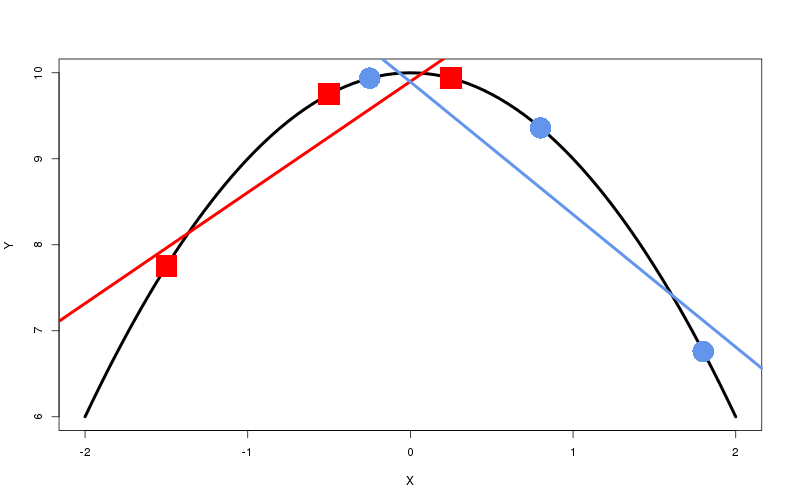

Effective Ancillarity
========================================================
author: Alex D'Amour
date: May 12, 2015
incremental: true
transition: none

GEP Box
=======================================================

************
A role model...

on the role of models.

All models are wrong...
========================================================

************
Predictions do not match true distribution in all cases.

Easily formalized by discrepancy measures (e.g., empirical vs nominal coverage, divergencee between empirial predicted distribution, etc.).

... but some are useful?
========================================================

************
Despite errors, model predictions are a **reasonable approximation** to the truth.

"Usefulness" and "Reasonability" are task-specific.

What if the goal of our task is to **generalize** our inferences to new settings?

Statistical task
========================================================

**Data**: Let $Z = (Y, W)$ be the observed sample:
 * $Y \in \mathcal Y$ is the outcome of interest.
 * $W \in \mathcal W$ is a set of **conditioning statistics**.
 
**Region of Interest**: Let $\mathcal E \subset \mathcal W$ be a set of "generalization conditions of interest".

**Goal**: On the basis of one or several samples $\{Z_k\}$, **generalize** to $P(Y' \mid W')$ across $W' \in \mathcal E$.

**Note**: Special interest here where $\mathcal E$ is not a singleton.

Statistical task: Examples
===========================================================
**Simple linear regression**.
$Z_k$ is vector of outcomes $Y_k$, vector of predictors $X_k$, and sample size $N_k$.

Conditioning statistics $W_k = (X_k, N_k)$.

Generalize to $W' \in \mathcal E$ where each entry of $X'$ is contained in an interval $(a,b)$, and $N' \in \mathbb N$.

Examples of generalization:
* **Point prediction**: $N' = 1, X' = x \in (a,b)$.

Statistical task: Examples
========================================================
**Social network analysis**.
$Z_k$ is array of pairwise interaction records $Y_k$ among actors $V_k$.

Conditioning statistics $W_k = (V_k)$ (i.e. number of and properties of actors).

Generalize across sample sizes, to $W' \in \mathcal E$ where number of actors $|V'| \in \mathbb N$.

Example of generalization:
* **Shrinkage**: Pool information between $Y_1 \mid V_1$ and $Y_2 \mid V_2$ with $|V_1| \neq |V_2|$.

Statistical task: Examples
========================================================
**Point process**.
$Z_k$ is set of observed points $Y_k$ in spatiotemporal observation window $A_k$.

Conditioning statistic $W_k = (A_k)$.

Generalize across observation windows, to $W' \in \mathcal E$ where area $|A_k| \in [A_{min}, \infty)$.

Example of generalization:
* **Comparison**: $Y_1 \mid A_1$ and $Y_2 \mid A_2$ generated by same process?

Statistical task: Examples
=========================================================
**Causal inference from observational study**.
$Z_k$ is observed outcomes $Y_k$, treatment-invariant covariate matrix $X_k$, and treatment assignments $T_k$.

Conditioning statistics $W_k = (X_k, T_k)$.

Generalize to situaton where treatment set by intervention, i.e. $T_k \perp\!\!\!\!\perp X_k$.

Example of generalization:
* **Interpretation**: Interpret variation in inferred conditional expectation $\mathbb E[ Y \mid T ]$ as causal effect.

How are models useful?
========================================================
Without circularly invoking **model** or **parameter**:

**Single-sample**: Defines summaries of $Y_k$ that efficiently capture structure that remains **stable** across sampling perturbation under a given condition $W_k$. (**parameter**)

**Generalization**: specifies summaries that remain **stable** across variation in conditions of interest $\mathcal E$. (**superpopulation**)

Parameters are **stable** in both cases when the model is right.

**What happens when the model is wrong?**

Misspecification
========================================================

**Single-sample**: Focus of robustness and semiparametric literature.

Summaries of data with stability across resampling, subsampling, contamination.

Analytical tools: Influence curves, **non-projective sequences** with limits that represent single sample (model changes along sequence, "uniformity" arguments).

If stable, useful if $\mathcal E = \{W_k\}$.

<small>See, among others, Huber 1981, Hampel 1987, Bickel, et al. 1998, Yu 2013.</small>

Misspecification
===========================================================

**Generalization**: To my knowledge, little work. 

Seek summaries with stability across **conditions** despite misspecification.

Analytical tools: **Projective sequences** governed by single overarchig stochastic process. Study relationship between elements of whole sequence, not just limit.

If stable, useful for more general $\mathcal E$.

From model to summary
========================================================
**Maximum likelihood estimation**

**Model Family**: $\mathcal P_{\Theta, \mathcal E} = \{\mathbb P_{\theta, W}\}_{\theta \in \Theta, W \in \mathcal W}$  with parameter $\theta \in \Theta$ and conditions $W \in \mathcal W$, with **stochastic consistency** between conditions.

**Model**: Each $\mathbb P_{\theta, W} = \mathbb P_\theta(Y \mid W)$, a candidate model under condition $W$.

**Truth**: $\mathcal P_{0, \mathcal W} = \{\mathbb P_{0, W}\}_{W \in \mathcal W}$, where $\mathbb P_{0,W} = \mathbb P_0(Y \mid W)$.

**Estimation**: $\hat \theta_{W_k} = \arg\max_{\Theta} \log \mathbb P_{\theta}(Y_k \mid W_k)$.

What are we estimating?
========================================================
**Correctly specified**: $\mathcal P_{0, \mathcal W} = \mathcal P_{\theta_0, \mathcal W}$ for some $\theta_0 \in \Theta$.

In this case, for all $W$ in $\mathcal E$, $\hat \theta$ is estimating $\theta_0$.

**Misspecified**: $\mathcal P_{0, \mathcal W} \not\subset \mathcal P_{\Theta, \mathcal W}$.

For each $W_k$, $\mathbb P_{\hat \theta_{W_k}, W_k}$ is estimating the **"best" approximation** in the model family to $\mathbb P_{0, W_k}$ based on the observed data.

Can we formalize this under a single operator?

Estimator as functional
=========================================================
Represent estimator $\hat \theta_{W_k}(Y_k)$ as a **functional** $\Psi$ that operates on probability measures and returns a real vector in $\Theta$. Semiparametric literature.

Let $\hat {\mathbb P}_{W_k}$ be the empirical distribution of $W_k$. Then MLE can be written as:

$$\hat \theta_{W_k} = \Psi_{\mathcal P_{\mathcal \Theta}}(\hat {\mathbb P}_{W_k}) = \arg\max_{\Theta}  \mathbb E_{\hat {\mathbb P}_{W_k}}[\log \mathbb P_{\theta}(Y_k \mid W_k)].$$

<small>**Remark**: Reduces to the MLE equation because $\hat P_{W_k}$ is a point mass at $Y_k$.</small>

Introducing: effective estimand
===========================================================
Plugging the truth $\mathbb P_{0, W_k}$ into the operator, we obtain

$$\bar \theta_{W_k} = \Psi_{\mathcal P_{\mathcal \Theta}}(\mathbb P_{0, W_k}) = \arg\max_{\Theta}  \mathbb E_{\mathbb P_{0, W_k}}[\log \mathbb P_{\theta}(Y_k \mid W_k)].$$

<small>
**Remark**: Maximand is a negative KL-divergence plus constant.
</small>

Call $\bar \theta_{W_k}$ the **effective estimand**, which $\hat \theta_{W_k}$ **targets**.

Stability across conditions
============================================================
**Correctly specified**: $\bar \theta_{W_k} = \theta_{0, W_k}$ for all $W_k$ by property of KL-divergence.

Invariant to $W_k$ because of **ancillarity** induced by conditional inferential distribution.

**Misspecified**: $\bar \theta_{W_k}$ is the best available approximation to $\mathbb P_{0, W_k}$ in $\mathcal P_{\Theta, W_k}$.

No guarantee of invariance. If not, generalizing to new $W_k$ is incoherent -- the procedure is effectively estimating different quantities at each $W_k$.

Instability: regression example
============================================================
<small>
$Y = 10 - W^2 + \epsilon \quad \textrm{ but } \quad E_{\theta}(Y) = \theta_1 + \theta_2 X$. $X_1 = \{-1.5, -0.5, 0.25\}, X_2 = \{-0.25, 0.8, 1.8\}$. $\mathcal E = \{(X_k, N_k): N_k = 3, X_k \in [-2,2]^3\}$</small>

Consequences of instability
===========================================================
Parameter of interst changes with $W_k$.

For many tasks, propagating information between conditions when effective estimand differs is counterproductive.
* **Prediction**: Breaks symmetry of data/prediction.
* **Comparison**: Null hypotheses depend on unknown parameters.
* **Pooling**: Shrinkage to unknown locations.

Effective ancillarity
===========================================================
**Correct model**: Ancillarity of $W_k$ grants stability because $W_k$ carries no information about the parameter itself, just about measurement of parameter.

**Misspecified model**: Ideally, $W_k$ carries no information about the effective estimand.

We say $W_k$ is **effectively ancillary** with respect to a true process $\mathcal P_{0, \mathcal W}$, a proposed model family $\mathcal P_{\Theta, \mathcal W}$, and a conditioning set $\mathcal E$ iff the distribution of $W_k$ does not depend on $\bar \theta_{W_k}$ for all $W_k$ in $\mathcal E$.

Effective ancillarity
============================================================
In some sense, trivial. $\bar \theta_{W_k}$ and $W_k$ deterministically related.

Definition draws distinction between **nominal** and **effective** ancillarity.

Even if model interally declares $W_k$ to be ancillary, **effective estimand** determined by $W_k$.

Single-sample goodness-of-fit analyses (e.g. consistency asymptotics) are not enough. Requires investigation of structure across conditions.

Probing effective ancillarity
============================================================
Define population process as a **stochastic process** indexed by $W_k$.

Assume with known population properties (often asymptotic) separately from proposed model family.

Investigate (perhaps through asymptotics) whether **effective estimand** is invariant to the finite dimensional distribution selected by any $W_k \in \mathcal E$.

**Complicate model** to subsume inhomogeneity.

**Change conditioning** to obtain invariance to inhomogeneity.

Effective ancillarity and dependence
============================================================
When data are dependent, many single-sample summaries are inhomogeneous in $W_k$.

**Saturation** in repulsive point processes: rate decreasing in temporal dimension of $A_k$. For uniform models, effective estiand decreasing in observation time if $\mathcal E$ spans large ranges of $A_k(t)$. Recover with a model with repulsion.

**Sparsity** in networks: larger samples have smaller proportions of edges. For proposed exchangeable actor model, effective estimand decreasing in size of actor sample if $\mathcal E$ spans ranges of large $|V_k|$. Recover by conditionign on less with a truncated model.

Effective ancillarity and causality
============================================================
**Selection on observables**: Differences in observed conditional expectations depend on assignment mechanism. Recover by conditioning on more (e.g. propensity scores, matching).

Conclusion
=============================================================
Introduced notion of **stability** that makes a model **useful** for **generalization**, even if it is misspecified.

Because internal model parameters are not "real", evaluate stability as a property of the **effective estimand**.

Procedure is **stable** if **conditioning statistics** are **effectively ancillary**.

**Projective analyses** can be used to identify invariances that recover effective ancillarity.
